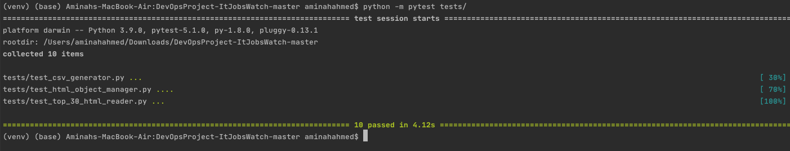
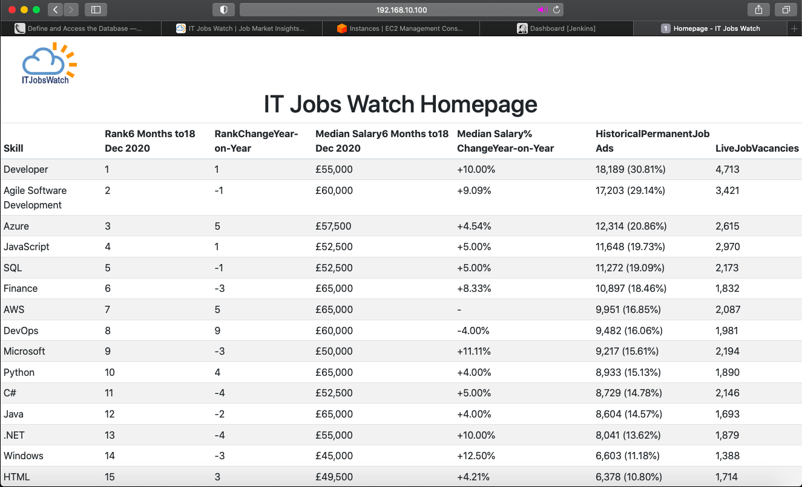

# Web Scraper Project

## Introduction
This app scrapes data from ITJobsWatch and writes to a file on the local host. The aim of this project is to deploy the app on a virtual machine and build a CI/CD pipeline.

## Run app on local machine
1. Clone code and open with PyCharm.
2. Install any package and dependencies, these can be found in the requirements.txt file.
3. Run main.py file and confirm the app runs on the local host.

## Running local tests
1. Set test_env to `live` in the config.ini file
2. Run the following command `pip3 install -U pluggy`
3. Run
```bash
python -m pytest tests/
```
4. The following output should be displayed



## CI Pipeline
1. Navigate to Jenkins
2. Configure the job.
3. Add the following commands to the build step
```bash
sudo apt-get update
# Install python pip module
sudo apt-get install python3-pip -y
# Install pytest
pip3 install -U pytest
# Install BeautifulSoup4
sudo pip3 install BeautifulSoup4
```

Testing 1    
Testing 2    
Testing 3 - checking failures are not pushed to main


## Ansible Playbook Deployment
# Ansible Configure Testing
```yaml
---
- name: provision web scraper app
  hosts: host_app
  gather_facts: yes
  become: True
  become_user: root
  become_method: sudo
  vars:
    DB_HOST: db_private_ip

  tasks:
    - name: apt update and upgrade
      apt:
        upgrade: "yes"
        update_cache: "yes"
        cache_valid_time: 86400

    - name: install list of packages
      apt:
        pkg:
        - python3
        - python3-pip
        state: present

    - name: Copy app files
      copy:
        src: /home/ubuntu/DevOpsProject-ItJobsWatch-master
        dest: /home/ubuntu/
        force: no

    - name: Install Pytest and BeautifulSoup4 using pip3
      pip:
        name:
          - pytest
          - BeautifulSoup4

    - name: Run tests
     # become: yes
      shell: python3 -m pytest tests/
      args:
        chdir: /home/ubuntu/DevOpsProject-ItJobsWatch-master

```

### Ansible EC2 Creation
2. Create the following directory called group_vars/all
3. Create an Ansible Vault in this location using the following command:
```yaml
ansible-vault create file.yml
```
4. Copy the following code into your EC2 Playbook
```yaml
---
- hosts: local
  connection: local
  gather_facts: true
  become: true
  vars:
    key_name: eng74-aminah-aws-key
    region: eu-west-1
    image: ami-0dc8d444ee2a42d8a
    id: "Aminah scraper ec2"
    sec_group: sg-0ffa8596995f6f497
    subnet_id: subnet-0999fd0326fda2d3c
    ansible_python_interceptor: /usrs/bin/python3

  tasks:
    - name: Installing dependencies
      apt:
        name:
          - python
          - python-pip
          - python3
          - python3-pip
        state: latest
    - name: Installing pip dependencies
      pip:
        name:
          - boto
          - boto3
          - nose
          - tornado
          - awscli
        state: present

    - name: get instance facts
      ec2_instance_facts:
        aws_access_key: "{{ aws_access_key }}"
        aws_secret_key: "{{ aws_secret_key }}"
        region: "{{ region }}"
      register: result

    - name: create ec2 instance
      ec2:
        aws_access_key: "{{ aws_access_key }}"
        aws_secret_key: "{{ aws_secret_key }}"
        assign_public_ip: true
        key_name: "{{ key_name }}"
        id: "{{ id }}"
        vpc_subnet_id: "{{ subnet_id }}"
        group_id: "{{ sec_group }}"
        image: "{{ image }}"
        instance_type: t2.micro
        region: "{{ region }}"
        wait: true
        count: 1
        instance_tags:
          Name: eng74-aminah-scraper-ec2

  tags: ['never','create_ec2']
```
3. Run the following commands
```
ansible-playbook create_ec2.yml --ask-vault-pass --tags create_ec2
```

### Tests
* Testing CD pipeline   
* Testing CD pipeline 2
* Testing CD pipline 3 - new instance
* Testing CD pipeline 4
* Testing cd pipeline 5 - addition of flask files 


## Flask
### Run on local hosts
1. Create an app.py file
2. Create a templates folder and store a base.html file and home.html file here.
3. Instal flask and any other dependencies such as pandas
4. Run flask using the command
```bash
flask run
```
5. Once confirmed the app is running as expected on the local host, navigate to the development environment.

### Run on Dev Env
1. Copy relevant flask files, this will include the app.py file, the templates folder and static folder.
2. Run `vagrant up` and `vagrant ssh`
3. Navigate to location of app folders
4. Install flask and pandas
```bash
pip3 install flask
sudo apt install python3-flask -y
```
5. Amend the app.py file to set host='0.0.0.0' to allow all incoming connections. If these repo has been cloned, this step is not necessary.
6. Run main.py to download a csv file of ItJobsWatch, ensure the location matches the location specifed in app.py
7. Run the following command

```bash
flask run --host=192.168.10.100
```     

