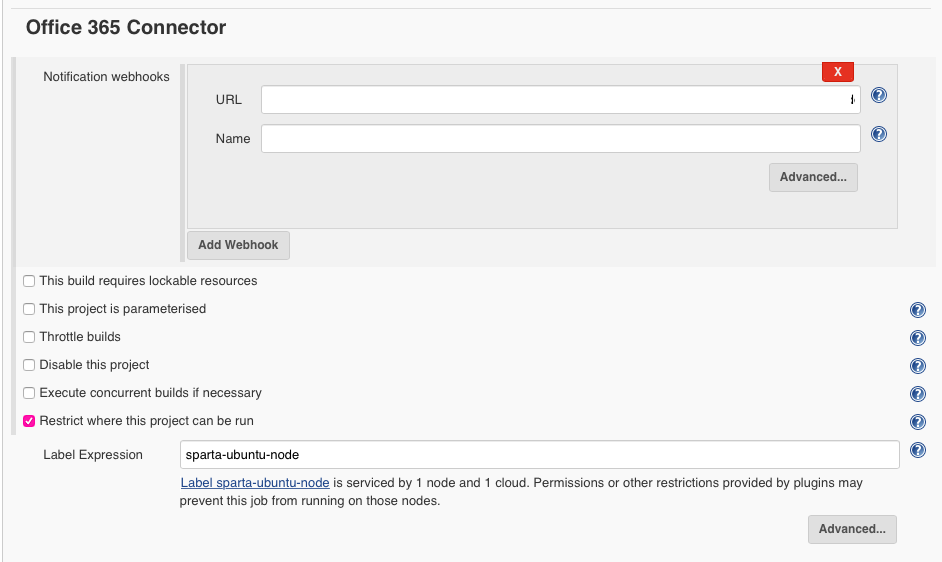
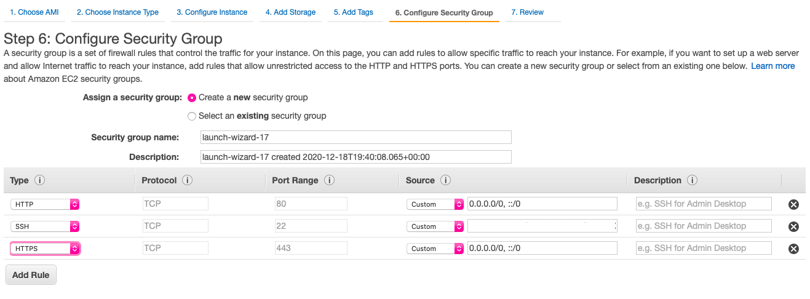
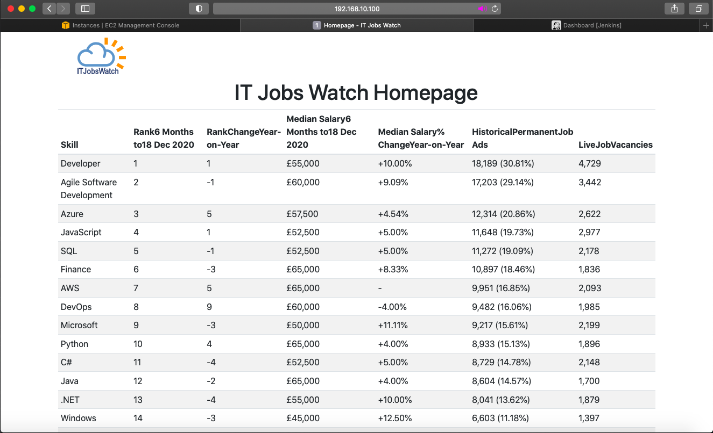

# Web Scraper Project

## Introduction
This app scrapes data from ITJobsWatch and writes to a file on the local host. The aim of this project is to deploy the app on a virtual machine and build a CI/CD pipeline. An increment was introduced to build a front-end webpage for the app using Flask.
This documentation will include a step-by-step of the process as well as instructions for simply cloning and running the code.

# Step-by-Step

## Run app and tests  on local machine
1. Open app with PyCharm.
2. Install any package and dependencies, these can be found in the requirements.txt file but PyCharm typically prompts to do so.
3. Run the following command `pip3 install -U pluggy` to update pluggy to the latest version.
4. Run `python3 main.py` and confirm the app is running i.e. a user interface is presented and files are downloaded as expected.
5. Navigate to config.ini file and set test_env to `live`.
6. Run tests with `python3 -m pytest tests/ `
7. The following output should be displayed


## Running on Dev environment
1. Clone the app files into a new directory.
2. Run `vagrant init` to create a Vagrantfile
3. Configure the Vagrantfile as follows:
```ruby
# Install required plugins
required_plugins = ["vagrant-hostsupdater"]
required_plugins.each do |plugin|
    exec "vagrant plugin install #{plugin}" unless Vagrant.has_plugin? plugin
end

Vagrant.configure("2") do |config|
  # Configure box name
  config.vm.box = "ubuntu/bionic64"
  # Configure network
  config.vm.network "private_network", ip: "192.168.10.100"
  config.hostsupdater.aliases = ["development.local"]
  # Sync the app folder(not copying in, syncing so is we make changes in the vm, reflected here too)
  config.vm.synced_folder"/Users/aminahahmed/AWS/deploy_web_scraper/DevOpsProject-ItJobsWatch-master", "/home/ubuntu/"
  # Provision the vm with a provisioning file
  config.vm.provision "shell", path: "provision.sh"

end
```
4. Create a provisioning file ensuring it is in the same location specified in the Vagrantfile. The provisioning file is as follows:
```bash
# Update source list
sudo apt-get update
# Install python pip module
sudo apt-get install python3-pip -y
# Install pytest
pip3 install -U pytest
# Install BeautifulSoup4
sudo pip3 install BeautifulSoup4
```
5. Run `vagrant up` and `vagrant ssh`
6. Navigate to location of app files `cd /home/ubuntu`
7. Amend the cmd_user_interface.py and top_30_csv_generator.py files to write to the home directory `~/`, not Downloads as this directory does not exist on the vagrant machine.
8. Amend the test_csv_generator.py test to also reflect the new write location.
9. Run `python3 main.py`. Confirm the app is running as expected.
10. Run `python3 -m pytest tests/` and confirm the tests are all passing as shown.    


## CI Pipeline
1. Navigate to Jenkins
2. Select 'new item' and configure as shown below. For a more in-depth explanation, visit this repository.
3. General    

4. Office 365 Connector    

5. Source Code Management
    
6. Build Triggers     
   
7. Build Environment    

8. Build    
     
9. Post-Build Actions      

10. Create a webhook for your repository. Select the repository `settings`, `webhooks` and `add webhook`. Configure as shown:

11. Verify pipeline. Push changes to dev branch and confirm whether only successful builds result in merges with main.
  * Testing 1    
  * Testing 2    
  * Testing 3 - checking failures are not pushed to main


## Ansible Playbook Deployment
### VPC and Subnets
1. Navigate to the AWS Management Console   
2. Select VPC from services and create a new VPC.
   
3. Navigate to subnets and select 'create'.
4. Select you VPC id and proceed to create a public subnet.

5. Navigate to Network ACLs and select 'Create network ACL'. Give a name, select your VPC and click create.
6. Proceed to configure rules for the ACLs.
7. Navigate to Internet gateways and create a new gateway. Attach this to your VPC by selecting the gateway, clicking 'Actions' and selecting 'Attach to VPC' from the drop-down.
8. Navigate to route tables. Click 'create route table', give a name and select your vpc.
9. Select the route table
10. Edit routes to add a destination for 0.0.0.0/0 which is targeted at the internet gateway.
11. Edit subnet associations to include your public subnet.


### EC2
1. Navigate to EC2.
2. Create an instance for the controller, following the steps shown below.
  1. Select an Amazon Machine Image   
  
  2. Choose Instance Type
  
  3. Configure Instance
  
  4. Add Storage - leave as default
  5. Add Tags
  
  6. Configure Security Group
  
  7. Review and Launch
3. Connect to the instance
4. Change the name of the instance by running the following command.
```
sudo hostnamectl set-hostname new_name
sudo reboot
```
5. You may need to logout and re-connect for this command to take effect.
6. Copy the app files into the instance
```bash
scp -i ~/.ssh/keyname.pem -r foldername ubuntu@ip:~/location
```
7. Copy the key files into a secure location
```bash
scp -i ~/.ssh/keyname.pem keyname.pem ubuntu@ip:~/.ssh/
```
6. Run the provision file, this may require giving execute permission first, `chmod +x provision.sh` and then running `./provision.sh`
7. Run `python3 main.py` and `python3 -m pytest tests/ ` to check the app runs tests have passed.


## Ansible
1. Inside the controller instance, install Ansible using the following commands:
```bash
sudo apt update
sudo apt install software-properties-common
sudo apt-add-repository --yes --update ppa:ansible/ansible
sudo apt install ansible
```
2. Navigate to hosts `cd etc/ansible`
3. Add a localhost to the hosts file.
4. Create folder called group_vars/all
5. Create an Ansible vault to store the location of the access keys
```bash
ansible-vault create aws_keys.yml
```
6. Give permissions to the keys so they can be accessed later.
```bash
chmod 666 aws_keys
chmod +x aws_keys
```
7. Create a directory for playbooks.

### Create EC2 Playbook
1. Copy the following code into your EC2 Playbook
```yaml
---
- hosts: local
  connection: local
  gather_facts: true
  become: true
  vars:
    key_name: eng74-aminah-aws-key
    region: eu-west-1
    image: ami-0dc8d444ee2a42d8a
    id: "Aminah scraper ec2"
    sec_group: sg-0ffa8596995f6f497
    subnet_id: subnet-0999fd0326fda2d3c
    ansible_python_interceptor: /usrs/bin/python3

  tasks:
    - name: Installing dependencies
      apt:
        name:
          - python
          - python-pip
          - python3
          - python3-pip
        state: latest
    - name: Installing pip dependencies
      pip:
        name:
          - boto
          - boto3
          - nose
          - tornado
          - awscli
        state: present

    - name: get instance facts
      ec2_instance_facts:
        aws_access_key: "{{ aws_access_key }}"
        aws_secret_key: "{{ aws_secret_key }}"
        region: "{{ region }}"
      register: result

    - name: create ec2 instance
      ec2:
        aws_access_key: "{{ aws_access_key }}"
        aws_secret_key: "{{ aws_secret_key }}"
        assign_public_ip: true
        key_name: "{{ key_name }}"
        id: "{{ id }}"
        vpc_subnet_id: "{{ subnet_id }}"
        group_id: "{{ sec_group }}"
        image: "{{ image }}"
        instance_type: t2.micro
        region: "{{ region }}"
        wait: true
        count: 1
        instance_tags:
          Name: eng74-aminah-scraper-ec2

  tags: ['never','create_ec2']
```
3. Run the following commands
```
ansible-playbook create_ec2.yml --ask-vault-pass --tags create_ec2
```
4. Confirm the instance has been created in the AWS Management Console.

### Provision Test Machine Playbook
1. Once the host has been created, add as a new host.
2. Navigate to `cd/etc/ansible` and run `sudo nano hosts` to add a new host.
3. Add the following to the host file
```
[host_app]
host_private_ip ansible_connection=ssh ansible_ssh_private_key_file=/home/ubuntu/.ssh/key_name.pem
```
4. Confirm the host can be accessed by running a ping command
```bash
ansible host_app -m ping
```
5. Return to playbook directory and create a new playbook for provisioning a test machine.
6. Copy the following code:

```yaml
---
- name: provision web scraper app
  hosts: host_app
  gather_facts: yes
  become: True
  become_user: root
  become_method: sudo
  vars:
    DB_HOST: db_private_ip

  tasks:
    - name: apt update and upgrade
      apt:
        upgrade: "yes"
        update_cache: "yes"
        cache_valid_time: 86400

    - name: install list of packages
      apt:
        pkg:
        - python3
        - python3-pip
        state: present

    - name: Copy app files
      copy:
        src: /home/ubuntu/DevOpsProject-ItJobsWatch-master
        dest: /home/ubuntu/
        force: no

    - name: Install Pytest and BeautifulSoup4 using pip3
      pip:
        name:
          - pytest
          - BeautifulSoup4

    - name: Run tests
     # become: yes
      shell: python3 -m pytest tests/
      args:
        chdir: /home/ubuntu/DevOpsProject-ItJobsWatch-master

```

## CD Pipeline
1. Navigate to Jenkins
2. Select 'new item' and configure as follows:
3. General    

4. Office 365 Connector    

5. Source Code Management
    
6. Build Triggers     
   
7. Build Environment    

8. Build and Post-Build   
     
9. Verify pipeline.
  * Testing CD pipeline   
  * Testing CD pipeline 2
  * Testing CD pipline 3 - new instance
  * Testing CD pipeline 4
  * Testing cd pipeline 5 - addition of flask files


## Flask
### Run on local hosts
1. Create an app.py file
2. Create a templates folder and store a base.html file and home.html file here.
3. Install flask and pandas
```bash
sudo apt install python3-flask -y
pip3 install pandas
```
4. Run flask using the command
```bash
flask run
```
5. Once confirmed the app is running as expected on the local host, navigate to the development environment.

### Run on Dev Env
1. Copy relevant flask files, this will include the app.py file, the templates folder and static folder.
2. Run `vagrant up` and `vagrant ssh`
3. Navigate to location of app folders
4. Install flask and pandas
```bash
pip3 install flask
sudo apt install python3-flask -y
pip3 install pandas
```
5. Amend the app.py file to set host='0.0.0.0' to allow all incoming connections. If these repo has been cloned, this step is not necessary.
6. Run main.py to download a csv file of ItJobsWatch, ensure the location matches the location specifed in app.py
7. Run the following command

```bash
flask run --host=vagrant_ip
```     

